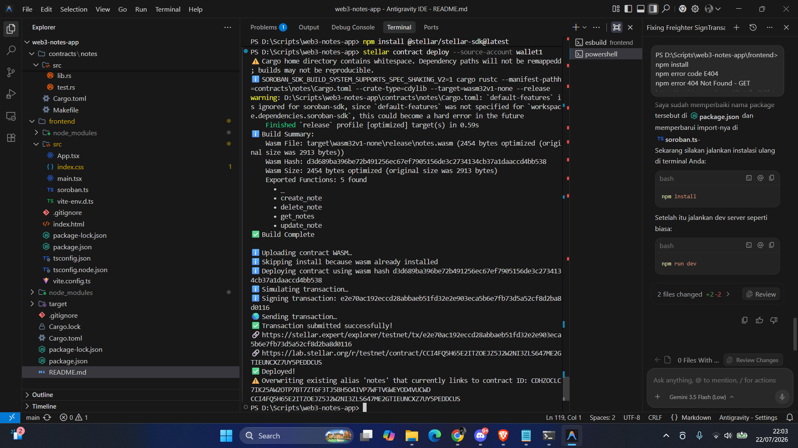
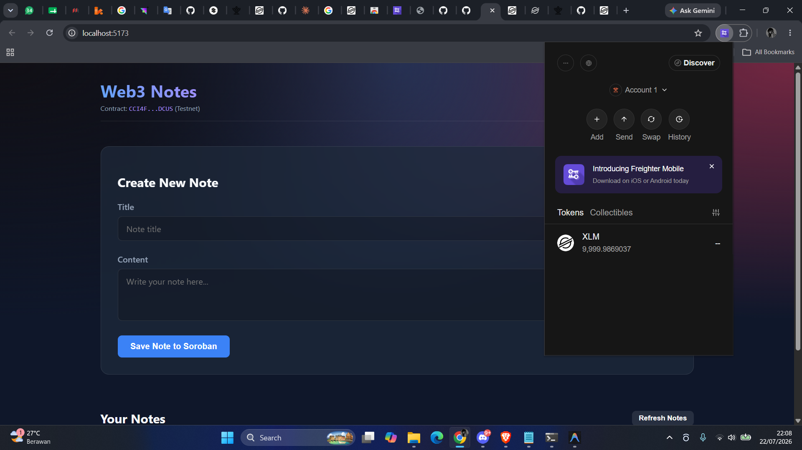
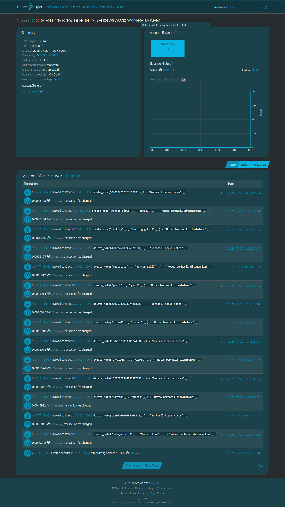

# Stellar Notes DApp

**Stellar Notes DApp** - Blockchain-Based Decentralized Note-Taking System

## Project Description

Stellar Notes DApp is a decentralized smart contract solution built on the Stellar blockchain using the Soroban SDK. It provides a secure, immutable platform for managing personal notes directly on the blockchain. The contract ensures that your data is stored transparently and is only manageable through predefined smart contract functions, eliminating reliance on centralized database providers.

The system allows users to create, view, and delete notes, leveraging the efficiency and security of the Stellar network. Each note is uniquely identified and stored within the contract's instance storage, ensuring data persistence and reliability.

---

## Project Vision

Our vision is to revolutionize personal productivity in the digital age by:

- **Decentralizing Data**: Moving note-taking from centralized servers to a global, distributed blockchain.
- **Ensuring Ownership**: Empowering users to have complete control and ownership over their digital thoughts and information.
- **Guaranteeing Immutability**: Providing a permanent, tamper-proof record of notes that cannot be altered or deleted by unauthorized third parties.
- **Enhancing Privacy**: Leveraging blockchain security to protect personal information from unauthorized access.
- **Building Trustless Systems**: Creating a platform where data integrity is guaranteed by code, not by company promises.

---

## Key Features

### 1. **Simple Note Creation**
- Create notes with just one function call.
- Specify title and content for each note.
- Automated ID generation for unique identification.
- Persistent storage on the Stellar blockchain.

### 2. **Efficient Data Retrieval**
- Fetch all stored notes in a single call.
- Structured data representation for easy frontend integration.
- Quick access to your entire note collection.
- Real-time synchronization with the blockchain state.

### 3. **Secure Deletion**
- Remove specific notes using their unique IDs.
- Permanent removal from the contract storage.
- Clean and efficient storage management.
- Immediate update of the note list after deletion.

### 4. **Transparency and Security**
- View all note activities on the blockchain.
- Blockchain-based verification of all storage actions.
- Immutable records of note creation and deletion.
- Protected against unauthorized modifications.

### 5. **Stellar Network Integration**
- Leverages the high speed and low cost of Stellar.
- Built using the modern Soroban Smart Contract SDK.
- Scalable architecture for growing note collections.
- Interoperable with other Stellar-based services.

---

## Setup & Deployment Instructions

### Smart Contract Setup (Soroban/Rust)

#### Prerequisites
1. **Rust**: Install Rust toolchain.
   ```bash
   curl --proto '=https' --tlsv1.2 -sSf https://sh.rustup.rs | sh
   ```
2. **WASM Target**: Add WASM compilation target.
   ```bash
   rustup target add wasm32-unknown-unknown
   ```
3. **Stellar CLI**: Install Stellar (formerly Soroban) CLI.
   ```bash
   cargo install --locked stellar-cli --features opt
   ```

#### Compilation & Build
To compile the smart contract:
1. Navigate to the contract folder or workspace root.
2. Build the contract:
   ```bash
   stellar contract build
   ```
   Or using cargo:
   ```bash
   cargo build --target wasm32-unknown-unknown --release
   ```
The compiled `.wasm` file will be located at `target/wasm32-unknown-unknown/release/notes.wasm`.

#### Deploying to Testnet
Configure your CLI with a Stellar Testnet identity:
```bash
stellar keys generate --global deployer --network testnet
```
Deploy the WASM contract:
```bash
stellar contract deploy \
  --wasm target/wasm32-unknown-unknown/release/notes.wasm \
  --source-account deployer \
  --network testnet
```
This returns the `Contract ID` (e.g. `CCI4FQ5H65E2ITZOEJZ5J2W2NI3ZLS647ME2GTIEUNCXZ7UY5PEDDCUS`).

---

### Frontend Setup (React/TypeScript/Vite)

#### Prerequisites
- **Node.js** (v18+) and **npm**

#### Installation
1. Navigate to the frontend directory:
   ```bash
   cd frontend
   ```
2. Install dependencies:
   ```bash
   npm install
   ```

#### Configuration
Update the [soroban.ts](file:///d:/Scripts/web3-notes-app/frontend/src/soroban.ts) file with your deployed contract information:
- Set `CONTRACT_ID` to your newly deployed contract address.
- Ensure `RPC_URL` is set to the correct Stellar Testnet RPC server: `https://soroban-testnet.stellar.org`.
- Configure `NETWORK_PASSPHRASE` (usually `Test SDF Network ; September 2015`).

#### Running Locally
To launch the Vite development server:
```bash
npm run dev
```
Open [http://localhost:5173](http://localhost:5173) in your browser.

---

## Contract Verification & Screenshots

### Deployed Contract Address
The smart contract has been successfully deployed to Stellar Testnet at the following address:
**`CCI4FQ5H65E2ITZOEJZ5J2W2NI3ZLS647ME2GTIEUNCXZ7UY5PEDDCUS`**

Below is the screenshot showing the successful deployment:


### Wallet Integration & Options
The DApp integrates with Freighter (and supports other wallet providers). Here are the wallet options available in the connection panel:


### Verification on Stellar Explorer
- **Explorer Account:** [GATASLTRGRO3GRWDRLPHUPUPE2YHLK3LVBL2V2ZIX7A2X2NSHLMQMAEA](https://stellar.expert/explorer/testnet/account/GATASLTRGRO3GRWDRLPHUPUPE2YHLK3LVBL2V2ZIX7A2X2NSHLMQMAEA)
- **Contract Calls & Transactions:** You can trace contract calls and check transaction hashes directly on [StellarExpert Testnet Explorer](https://stellar.expert/explorer/testnet/account/GATASLTRGRO3GRWDRLPHUPUPE2YHLK3LVBL2V2ZIX7A2X2NSHLMQMAEA).

Below is the verification details of the contract calls:


---

**Stellar Notes DApp** - Securing Your Thoughts on the Blockchain.
